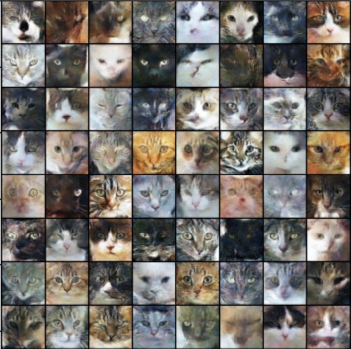

# Cat Image Generate [PyTorch]

  

## Introduction
This is a project that generates random cat images and provides a Docker image for easy deployment and distribution.
## Key Features
* Generates random cat images with different sizes and color schemes
* Saves the generated images to the local file system
* Provides a command-line interface for easy usage
* Includes a Docker image for easy deployment

## Model training
Users have several options to train the cat generate model:
* Download dataset from [kaggle](https://www.kaggle.com/datasets/spandan2/cats-faces-64x64-for-generative-models)
* Install the required dependencies by running pip install -r requirements.txt.
* Run `python3 train_model.py -sp path/to/input/folder` to train the model with default parameters on a local dataset.
* Run `python3 train_model.py -b batch_size -lr learning_rate` to train the model with your preferred batch size and learning rate.
  
## Generate image
### Using Python
- Run `python3 generate.py -c path/to/checkpoint -o path/to/output` to generate image
- Example: `python3 generate.py -c last_model.pth -o generated_image.png`
### Using Docker
- Run `docker pull nguyenlequang/cat_generate` to pull the Docker image.
