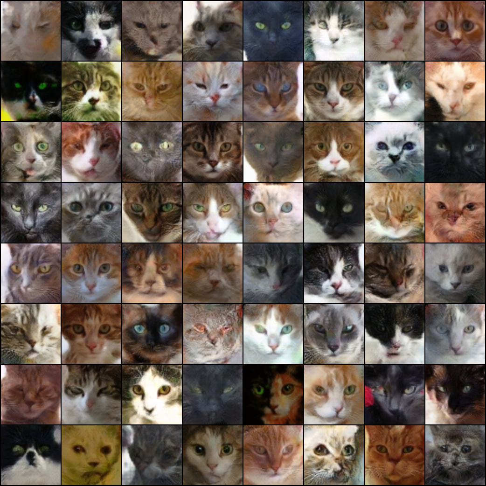

# Cat Image Generate [PyTorch]

  

## Introduction
This project utilizes **Diffusion GANs** to generate cat images from random noise. It combines the advantages of **Generative Adversarial Networks (GANs)** and **Diffusion Models**, improving the quality of generated images.
## Key Features
- Build architecture for Diffusion GANs.
- Train Diffusion GANs on a cat dataset.  
- Integrated **Weights & Biases (wandb)** for training monitoring.  
- **Docker** support for generating new cat images.
  
## Model training
Users have several options to train the cat generate model:
* Download dataset from [kaggle](https://www.kaggle.com/datasets/spandan2/cats-faces-64x64-for-generative-models)
* Install the required dependencies by running `pip install -r requirements.txt`.
* Run `python3 main.py -sp path/to/input/folder` to train the model with default parameters on a local dataset.
* Run `python3 main.py -b batch_size -lr learning_rate` to train the model with your preferred batch size and learning rate.
  
## Generate image
### Using Python
- Run `python3 generate.py -c path/to/checkpoint -o path/to/output` to generate image
- Example: `python3 generate.py -c cat_face_generate_model.pt -o generated_image.png`
### Using Docker
- Run `docker pull nguyenlequang/cat_generate` to pull the Docker image.
